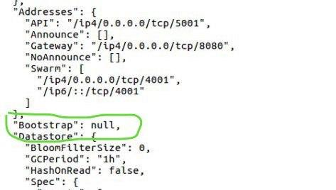

# Private IPFS Network - Docker

Create a private and dockerized ipfs network.

This repo uses [private-network-ipfs](https://github.com/7db9a/private-network-ipfs) as a submodule. So credits to its author. However, this README (you are reading from it now) is more understandable to me and is in English.

## Table of Contents

1. [Setup](#setup)
2. [Gotcha's](#gotchas)
3. [Helpful resources](#helpful-resources)

## Setup

* On a single machine (bootstrap node): steps 1 - 3a and 4 - 6.
* Other machines (nodes): steps 1, 2, 3b, 4, and 6.
* All machines: step 7.
* Any machine: step 8.

#### 1. Download and install

```
git clone --recursive https://github.com/7db9a/private-ipfs-docker.git/
cd private-ipfs-docker/private-network-ipfs
make up
```

#### 2. Ensure that the IPFS API is configured to allow cross-origin (CORS) requests

```
docker exec ipfs_host ipfs config --json API.HTTPHeaders.Access-Control-Allow-Origin '["*"]'
docker exec ipfs_host ipfs config --json API.HTTPHeaders.Access-Control-Allow-Methods '["PUT", "GET", "POST"]'
```

#### 3a. Generate key and copy

`docker run -it --name my-go golang:1.13 bash`

Get the key:

```
go get -u github.com/Kubuxu/go-ipfs-swarm-key-gen/ipfs-swarm-key-gen
./bin/ipfs-swarm-key-gen > swarm.key
```

Keep the shell open.

In another shell.

`docker cp my-go:go/swarm.key private-network-ipfs/data/`

You may now exit the container shell.

#### 3b. Copy key into other nodes.

The `swarm.key` you generated must be on all the nodes. Your nodes may be across the internet or on the same local area network. You don't want to publish your key to the world. I used rsync, but you can do what's best for you.

```
rsync -ve ssh \
data/swarm.key \
me@machine2:/home/me/projects/private-ipfs-docker/private-network-ipfs/data/
```

Generally, like this:

`rsync -ve ssh path/to/file.txt username@address:/home/path/to/dir`

#### 4. Remove the default boostrap node

`docker exec ipfs_host ipfs bootstrap rm --all`

Check that the bootsrap is empty

`docker exec ipfs_host ipfs config show`



#### 5. Get node information

`docker exec ipfs_host ipfs id`

```
{
	"ID": "QmRBMTxuQhk8fYmtwBb7JbYPFzydMznkTTrmWDf7AY62Pb",
	"PublicKey": "CAASpgIwggEiMA0GCSqGSIb3DQEBAQUAA4IBDwAwggEKAoIBAQCvGy9C9tzw0oJH0cdlrLSYORpFmaA53XB7XEd9u5rsY7X6jzUsR0n/X/T0+JblxZHqNC5xgL/kwGNYU7Pgr2mEuP6p3rokAufZSZUCXl0sqXjl53LDJsvWK8czpdSAg+ljWto7VbQAiz56hd7y0KCdrNpH/qySsOdRpJUbsvirG/AGKsJfYJrxNyfO1S9+prbi2XQHLywH1b7Z6dN7NZVVU5Ob/qp8RCRoqiSeZFtHCcsdGdExqh6z8u/pwVo0+O2gtdV2eFdw32T8rnVUrzHn+m3Y4RDwKuSSLeWBgHi5YzR3uVX/3QV78TOf94G+87y855Jj07hYn1qc82TKZ9XTAgMBAAE=",
	"Addresses": [
		"/ip4/127.0.0.1/tcp/4001/ipfs/QmRBMTxuQhk8fYmtwBb7JbYPFzydMznkTTrmWDf7AY62Pb",
		"/ip4/192.168.96.2/tcp/4001/ipfs/QmRBMTxuQhk8fYmtwBb7JbYPFzydMznkTTrmWDf7AY62Pb",
		"/ip4/172.16.254.1/tcp/4001/ipfs/QmRBMTxuQhk8fYmtwBb7JbYPFzydMznkTTrmWDf7AY62Pb"
	],
	"AgentVersion": "go-ipfs/0.4.23/5b1687d",
	"ProtocolVersion": "ipfs/0.1.0"
}

```

The above is an exmaple. You will have different information.

#### 6. Boostrap node


```
docker exec ipfs_host ipfs bootstrap add \
/ip4/192.168.96.2/tcp/4001/ipfs/QmRBMTxuQhk8fYmtwBb7JbYPFzydMznkTTrmWDf7AY62Pb
```

Your command will have a different path. See [Step 5](#5-get-node-information).

#### 7. Restart nodes

Do this on all the nodes, including bootrap.

`docker restart ipfs_host`

See if you're connected. Run this on all nodes, too.

`docker exec ipfs_host ipfs swarm peers`

`/ip4/192.168.96.2/tcp/4001/ipfs/QmRBMTxuQhk8fYmtwBb7JbYPFzydMznkTTrmWDf7AY62Pb`

If you get no response, see below about [network issues](#network-issues).

#### 8. Try and add a file to the network

```
echo 'Hello World!' > private-network-ipfs/staging/hello.txt
docker exec ipfs_host ipfs add /export/hello.txt
```

```
added QmfM2r8seH2GiRaC4esTjeraXEachRt8ZsSeGaWTPLyMoG hello.txt
 13 B / 13 B  100.00%%
```

On all the nodes, including the bootsrap:

`docker exec ipfs_host ipfs cat QmfM2r8seH2GiRaC4esTjeraXEachRt8ZsSeGaWTPLyMoG`

## Gotcha's

#### Netowrk Issues

Can't connect to the bootstrap node? Go get the bootstrap node's address and port number.

You can the address and port number from [step 5](#5-get-node-information).

... or you can do.

`hostname -I`

The port number is typically 4001.

Then on the peer node machines, check that the bootstrap node is listening. For example:

`telnet 192.168.1.5 4001`

If you can't connect, then maybe try another machine that all other peers can connect to.

## Helpful resources

#### https://medium.com/@s_van_laar/deploy-a-private-ipfs-network-on-ubuntu-in-5-steps-5aad95f7261b

Detailed guide and appears clearly written, but it's not for Docker.

#### https://github.com/Sitoi/private-network-ipfs

Has a detailed README for private network using Docker. Has a docker-compose.yml. It's in Chinese (?), but the Google translation is good enough.

This fine repo is a git submodule of the repo (you are reading from). I basically 'wrapped' my own README.md.

#### https://github.com/mohdrashid/docker-ipfs-cluster

Couldn't makes sense of `Change “/cluster daemon --bootstrap /ip4//tcp/9096/ipfs/” with`. With what?

#### https://github.com/psprings/docker-ipfs

It's for a private network, but there is no docker-compose file.

#### https://github.com/rongfengliang/ipfs-clutser-docker-compose

Unclear if this is a private network setup.

#### https://github.com/qnib/docker-ipfs

Looks good, but it's not a private network setup.
